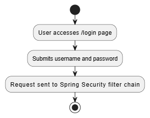
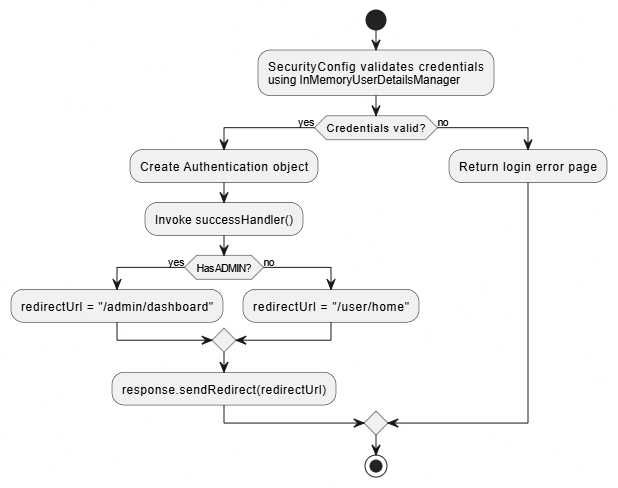
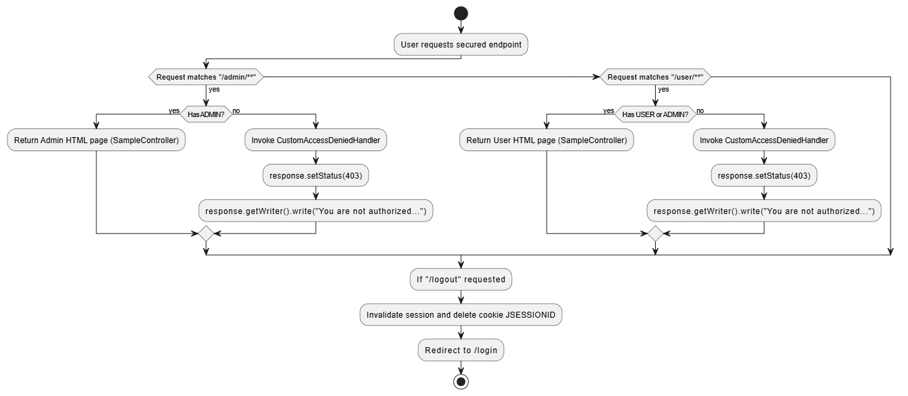
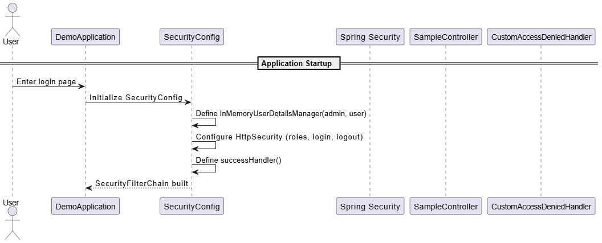
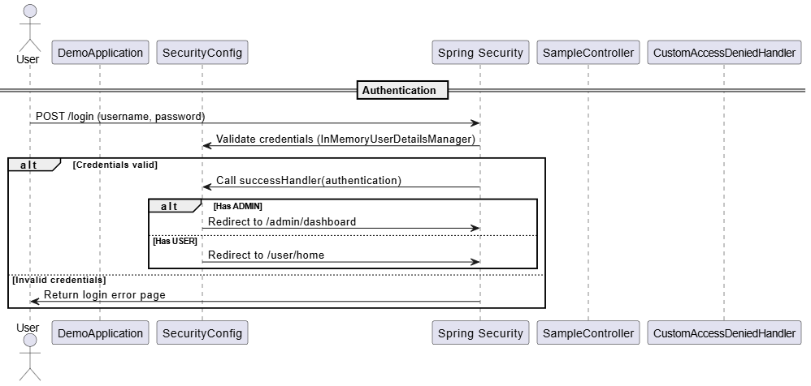
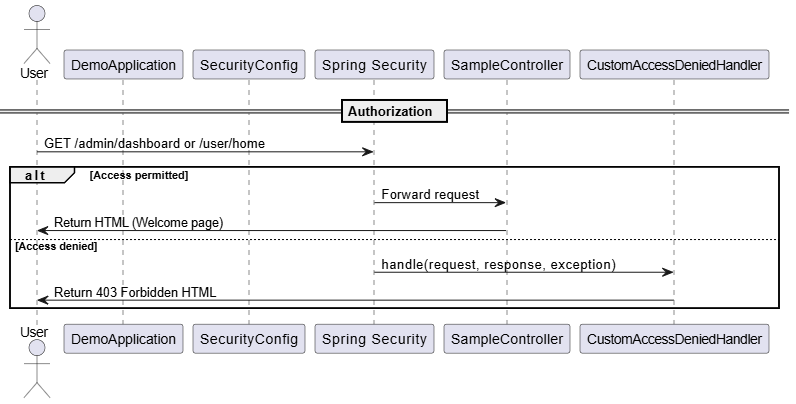
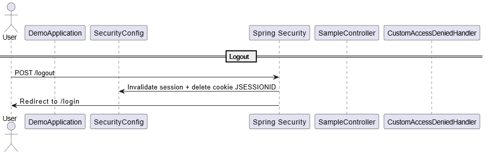

# Authentication and Authorization
These tactics focus on ensuring system security by first establishing the identity of users (Authentication) and then controlling access rights to system resources based on that identity (Authorization)

Authentication verifies who the user is, typically through credentials like usernames and passwords. Authorization determines what authenticated users are allowed to do enforcing policies via roles and permissions

In the project implemented with Spring Security authentication is achieved by verifying user credentials against an in memory user stor. Authorization is enforced by restricting access to URLs based on user roles like ADMIN or USER, controlling who can reach admin or user areas. This clear separation of verifying identity and granting permissions improves security by limiting access while maintaining modularity

## Expected behavior
1. The system required users to authenticate before accessing protected resources
2. Only users with the correct role can access role specific sections
3. After login users are redirected to pages that correspond to their roles
4. Unauthorized access attempts trigger an access denied message
5. The entire system consistently enforces authentication and authorization to protect sensitive resources

## Utilities
- Programming language: Java 23
- Framework: Spring boot (https://spring.io/projects/spring-boot)
- Sprint Web dependencies
- Sprint Security dependencies

## How to run the project
Navigate to cd authentication/demo and then use the command ```mvn spring-boot:run```. This will run the project in the browser ```localhost:8080```.

## Route Table

## Activity diagram
### Login


### Authentication


### Authorization


## Sequence diagram
### Application startup


### Authentication


### Authorization


### Logout
