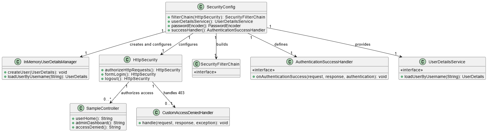
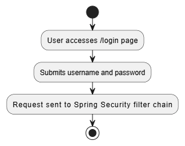
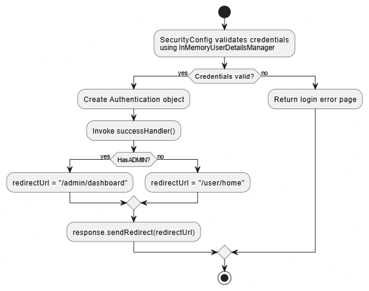
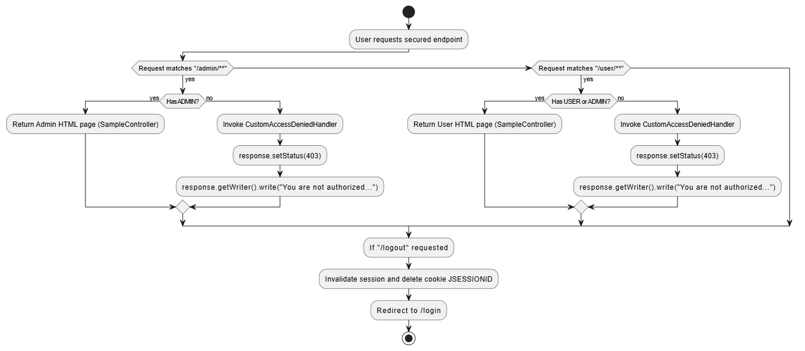
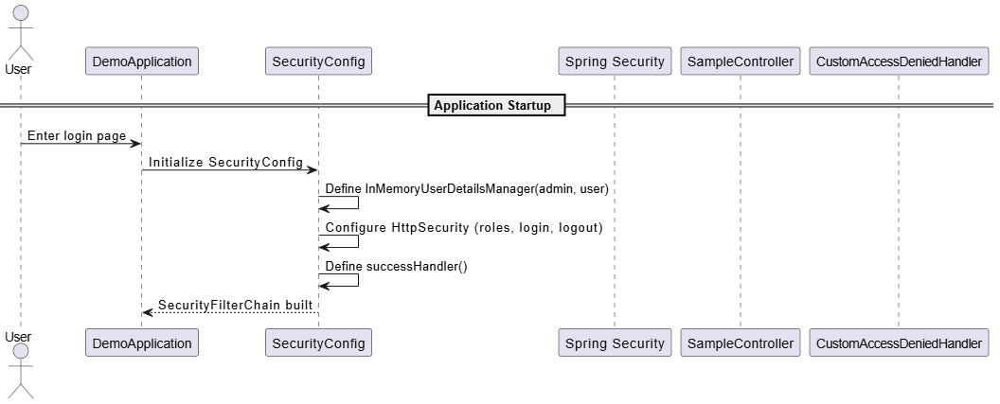
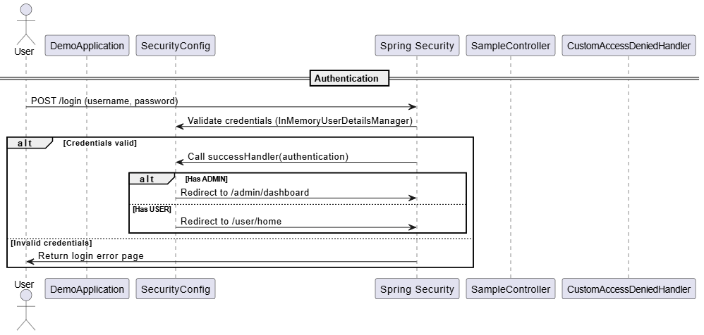
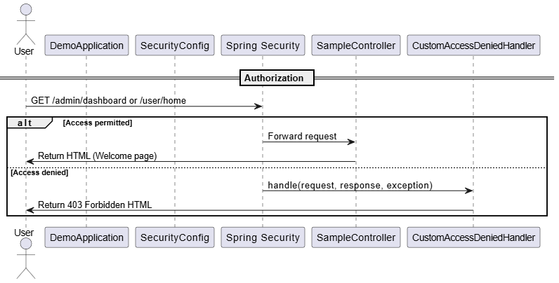
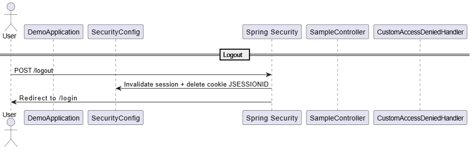

# Authentication and Authorization
These tactics focus on ensuring system security by first establishing the identity of users (Authentication) and then controlling access rights to system resources based on that identity (Authorization)

Authentication verifies who the user is, typically through credentials like usernames and passwords. Authorization determines what authenticated users are allowed to do enforcing policies via roles and permissions

In the project implemented with Spring Security authentication is achieved by verifying user credentials against an in memory user stor. Authorization is enforced by restricting access to URLs based on user roles like ADMIN or USER, controlling who can reach admin or user areas. This clear separation of verifying identity and granting permissions improves security by limiting access while maintaining modularity

## Expected behavior
1. The system required users to authenticate before accessing protected resources
2. Only users with the correct role can access role specific sections
3. After login users are redirected to pages that correspond to their roles
4. Unauthorized access attempts trigger an access denied message
5. The entire system consistently enforces authentication and authorization to protect sensitive resources

## Utilities
- Programming language: Java 23
- Framework: Spring boot (https://spring.io/projects/spring-boot)
- Sprint Web dependencies
- Sprint Security dependencies

## How to run the project
Navigate to cd authentication/demo and then use the command ```mvn spring-boot:run```. This will run the project in the browser ```localhost:8080```.

## Route Table
| **Route**              | **HTTP Method** | **Description**                              | **Access**    |
| ---------------------- | --------------- | -------------------------------------------- | ------------- |
| `/login`               | `GET`           | Displays the login page                      | Public        |
| `/login`               | `POST`          | Authenticates user credentials               | Public        |
| `/admin/dashboard`     | `GET`           | Admin dashboard page                         | ADMIN only    |
| `/user/home`           | `GET`           | User homepage                                | USER or ADMIN |
| `/logout`              | `POST`          | Logs out the user, invalidates session       | Authenticated |
| `/access-denied` (403) | `GET`           | Displays access denied page (custom handler) | All users     |

## Class Diagram
This class diagram illustrates the structure and interactions between components of our authentication and authorization system, which depends on implementations from Spring Security. The main components being utilized are as follows:

 - ```SecurityConfig``` - A central configuration class the sets up the security filter chain, a password encoder, a user information service, and an authentication handler.
 - ```InMemoryUserDetailsService``` - Enables user data to be persisted, enabling account creation and retrieval.
 - ```HttpSecurity``` - This defines security behaviors for authorization, login behavior, and logout behavior.
 - ```SecurityFilterChain``` - This represents the sequence of security checks that process requests from the end client.
 - ```AuthenticationSuccessHandler``` - Handles successful authentication responses by redirecting users to the correct landing page based on role.
 - ```UserDetailsService``` - This serves as a data storage method for user data that is required for authentication purposes.
 - ```SampleController``` - Creates the html content and endpoints that will be served to an end user upon successful authentication.
 - ```CustomAccessDeniedHanled``` - Creates the html content and endpoint that will be served to an end user upon an access denied exception.

Together, these components define how users login, get authenticated, get authorized, and get redirected to the correct endpoints based on their roles and level of permissions.



## Activity diagram
The activity diagram can be divided into three main parts: Login, Authentication and Authorization & Logout, each illustrating a specific responsability within the Spring Boot and Spring Security workflow. Together, they depict how the system enforces secure access control through a combination of authentication and authorization tactics as described in "Software Architecture in Practice 4th Edition" under the Security quality attribute.

### Login
In the first section, the user access the ```/login``` page and submits credentials. This interaction initializes the security filter chain in Spring Security. Which interceps and processes the request before it reaches any controller. From and architectural perspective, this part implements the "Identify Actors" phase of the authentication tactic desccribed by Bass. The system captures identity related information (username and password) and prepares it for verification. Spring Boot configuration automatically register this filter chain through the ```SecurityFilterChain```, as defined in the ```SecurityConfig``` class. This design ensures that all incoming request pass through the same entry point, enforcing a consistent authentication policy across the system.



### Authentication
The second part illustrate the core of the authentication tactic. Here ```SecurityCongig``` uses the ```InMemoryUserDetailsManager``` object representing the verified user identity and associated roles. Then a ```successHandler()``` determines the correct redirect URL based on the user role, either ```/admin/dashboard``` or ```/user/home```. This process aligns directly with the "Authentication Actor" tactic from the book, where the system verifies claimed identities through credentials and establishes a session or token representing trust. Spring Security abstracts this mechanism, making authentication reusable, configurable and testable, which enhances modifiability another architectural quality attribute emphasized in the book.



### Authorization & Logout
The final section corresponds to the authorization tactic and the session termination process. Once authenticated, the user attempts to access protected resources like ```/admin/**``` or ```/user/**```. Authorization checks are performed based on role definitions configured in ```HttpSecurity```. If access is granted the ```SampleController``` returns the corresponding HTML page. Otherwise the ```CustomAccessDeniedHandler``` responds with an HTTP 403 error. This embodies the "Authorize Actors" tactic, ensuring that authenticated users can only perform actions permitted by their assigned roles or priviliges.



## Sequence diagram
The complete sequence diagram represents the architectural realization of the authentication and authorization tactics from the security quality attribute described in the book Software Architecture in Practice 4th Edition. Theses tactics ensure that system operations are performed only by verified and permitted users, protecting confidentiality, integrity and controlled access. The diagram illustrates how Spring Boot, throguh Spring Security, structures its security mechanisms into sequential and coodinated stages. The diagram exemplifies how the tactics Authenticate Actors and Authorize Actors are combined into a coherent design that enforce strict access control. Each segment of the diagram (Application Startup, Authentication, Authorization and Logout) represents a phase, ensuring that the security lifecycle is complete: users are identified, verified, authorized and ultimately deauthenticated when leaving the system.

### Application startup
The Application Startup phase corresponds to the architectural groundwork neccesary for both authentication and authorization. According to Bass before authentication can occur, the architecture must define enforcement points that capture and control actor interactions with the system. In this phase ```SecurityConfig``` initializes the ```SecurityFilterChain```, effectively embedding Spring Security filters into the application requrest pipeline. This structure guarantees that all requests are intercepted by the same mechanism, creating a unified enforcement point where identity verification and policy decisions will occur. From a tactical perspective, this phase establishes the context for the Authenticate Actors tactice by ensuring that every future request first passes through a secure verification gateway. The centralization of interception also directly supports the Authorize Actors Tactic later, since startup sequence froms the architectural foundation that enables both authentication and authorization tactics to operate coherently across the application.



### Authentication
The Authentication phase directly embodies the Authenticate Actors tactic described in the book, which focuses on verifying a users claimed identity and creating a trustworthy representation of that identity for subsequent use. In this phase, once the user submits credentials, Spring Security validates them via the ```InMemoryDetailsManager```. Upon successful verification, an Authentication object is created, representing the authenticated actor and their associated roles. The ```successHandler()``` determines rediretion based on the actor role, cpleting the process of identity establishment and user specific response. This phase demostrates how Spring Security enforces identity verification in a modular way, decoupled from application logic. Such separtion aligns with the book principle that authentcation tactics should be encapsulated and replaceable supporting modifiability and long term maintainability of the security architecture.



### Authorization
The Authorization phase represents the full realization of the Authroize Actors tactic. Once authentication has established a trusted identity, this tactic determines which actions that identity is permitted to perform. Each request to a protected resource, such as ```/admin/dashboard``` or ```/user/home``` is evaluated against the role based rules defined in ```HttpSecurity```. If the actor possesses the requred privileges, access is granted and the ```SampleController``` serves the appropriate page, otherwise the ```CustomAccessDeniedHandler``` is triggered to return a 403 response. This aligns directly with the definition of authorization as a mechanism that restricts operations based on privileges while maintaining architectural clarity between authentication (who the actor is) and authorization (what the actor can do).By externalizing authorization rules within Spring Security configuration rather than scattering checks across controllers, the architecture maintains a clean separtion of concerns, ensuring consistent enforcement of the Authorize Actors tactic accross all endpooints.



### Logout
The Logout phase concludes the lifecycle of the authentication tactic by revoking identity trust. In this stage, Spring Security invalidates the user sessions and deletes the ```JSESSIONID``` cookie, effectively dissolving the association between the authenticated actor and the system. This guarantees that authorization priviliges are no longer applicable once logout occurs. This phase preserves system integrity and confidentiality by ensuring that authenticated sessions have a clear termination point. Trust must be explicitly established and explicictly revoked. This closing step complete the security lifecycle that began in authentacation and authorization, fullfilling the principles for maintaining secure and controlled access throughout the system operation.

