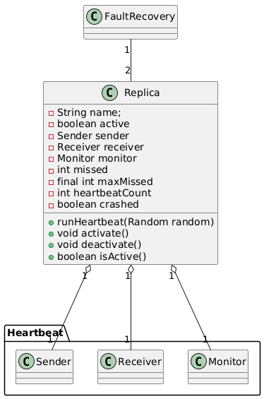
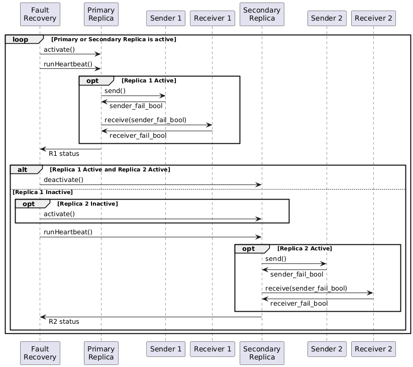
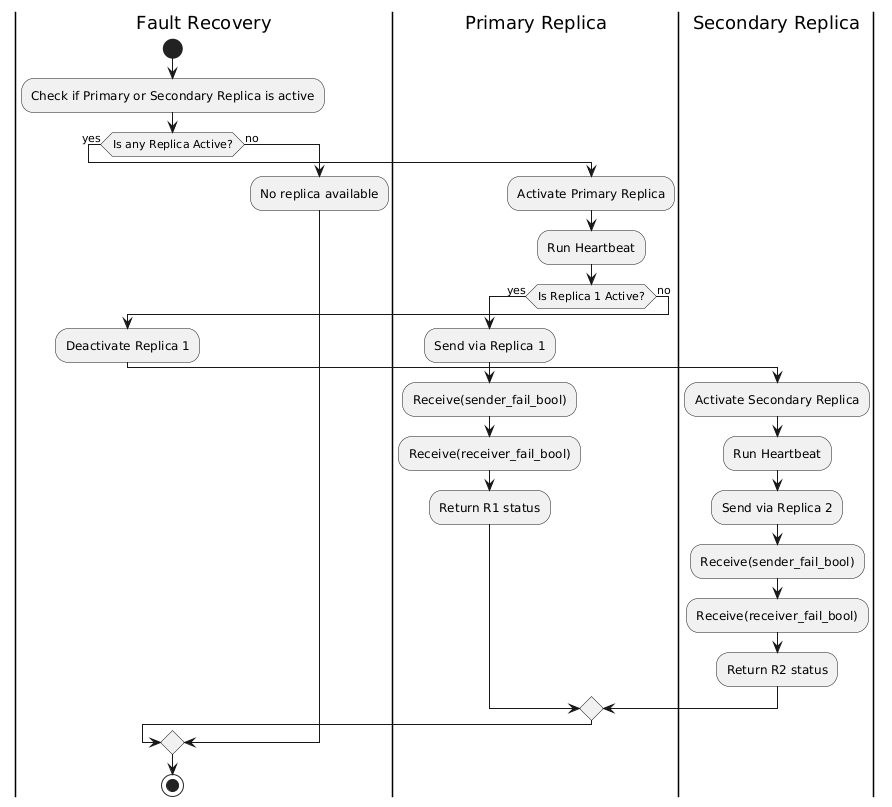

# Fault recovery
Fault recovery ensures continous operation of critical autonomous vehicle subsystems like navigation and perception by switching to backup components or restoring system state after failure. This maintains satefy and reliability in real time vehicle control. The recovery mechanism is key to fault tolerant autonomous driving systems.

## Expected behavior
1. The program will print heartbeat send/receive messages for both primary and secondary replicas
2. When the primary replica fails, the secondary activates and takees over sending heartbeats
3. The system stops if both replicas fail, indicating a critical fault that cannot be recovered automatically

## Class diagram

This simplified representation of a cold spare is based on the Heartbeat tactic.
This behavior is encapsulated in `Replica`, which mimics the ability of initializing
a new process and monitoring its behavior. The `FaultRecovery` class maintains two
`Replica`s. While the primary is active, the secondary is guarenteed put into a cold state with
`deactivate`. If/when the primary `Replica` fails, the secondary is activated but given no
shared state information other than a `Random` instance. Instead, it picks up with no prior knowledge. This
simplifies the `FaultRecovery` implemenation at the expense of theoretical start time and lost information.

The diagram show how backup components (Called "replicas") use simple heartbeat signals to detect failures.

- There is a main class called FaultRecovery, which manages the whole process.
- Each replica contains a sender, receiver and monitor to send and check heartbeat signals.
- If a heartbeat is missed too many times, the system knows something failed and can try to recover by switching replicas.

This way, the vehicle can quickly find problems in navigation or perception and use backups to stay safe and reliable.

## Sequence diagram
The following diagram tracks the synchronous message flow between classes. In practice, these could be replaced
with asynchronous messages across a network.

This sequence diagram shows the hearbeat process for fault recovery between two replicas in the vehicle subsystem.

- The fault recovery system first activates a primary and secondary replica and starts its heartbeat
- If replica 1 is active, it sends a hearbeat signal via sender 1. A receiver checks if the signal was successfully sent and received
- The system tracks whether sending or receiving the heartbeat fails
- If replica 1 becomes inactive and replica 2 is inactive, replica 2 activates and run its heartbeat similarly using sender 2 and receiver 2.
- This process continously loops, checking the status of each replica to detect faults and ensure one replica is always active.

It shows two backup system take turns sending and receiving status signals to confirm each is working and switch control if a failure occurs. This supports fault detection and recovery in the vehicle navigation or perception subsystem.

## Activity diagram
This Activity Diagram shows the activation process and fault recovery of both Replicas within the Vehicle Subsystem

- The Fault Recovery Starts and checks to see if there are Replicas that are active; if there are none, it shuts off and goes to its final state
- If there are replicas, it will go to the Active Primary Replica Placement and begin running the Heartbeat Function
- Once the function completes, it will send the R1 (Replica 1) status back to the Fault Recovery
- If Replica 1 is offline, then it will be sent a deactivation command and the activation command to Replica 2
- Replica 2 will go through the Heartbeat Function in R1's stead, ultimately sending back its status.
- It shows two backup systems taking turns sending and receiving status signals to confirm each is working and switch control if a failure occurs. This supports fault detection and recovery in the vehicle navigation or perception subsystem.

With that, the fault detector within the Vehicle Navigation or the Perception Subsystem will constantly stay online, depending on the number of replica heartbeats one has, while the others can be fixed in the interim

