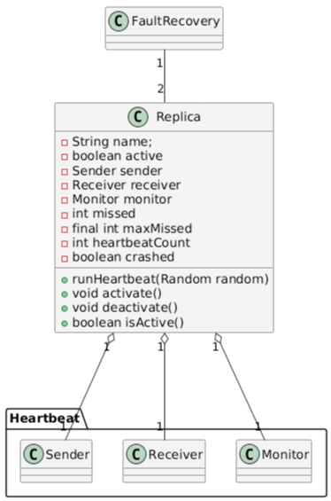
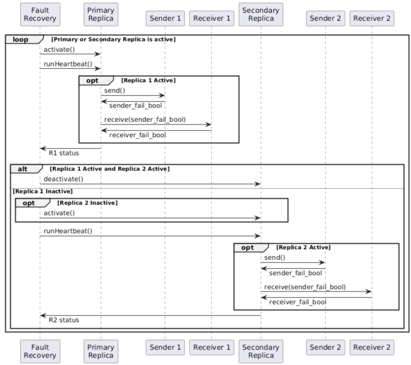

# Fault recovery
Fault recovery ensures continous operation of critical autonomous vehicle subsystems like navigation and perception by switching to backup components or restoring system state after failure. This maintains satefy and reliability in real time vehicle control. The recovery mechanism is key to fault tolerant autonomous driving systems.

## Expected behavior
1. The program will print heartbeat send/receive messages for both primary and secondary replicas
2. When the primary replica fails, the secondary activates and takees over sending heartbeats
3. The system stops if both replicas fail, indicating a critical fault that cannot be recovered automatically

## Class diagram

## Sequence diagram

