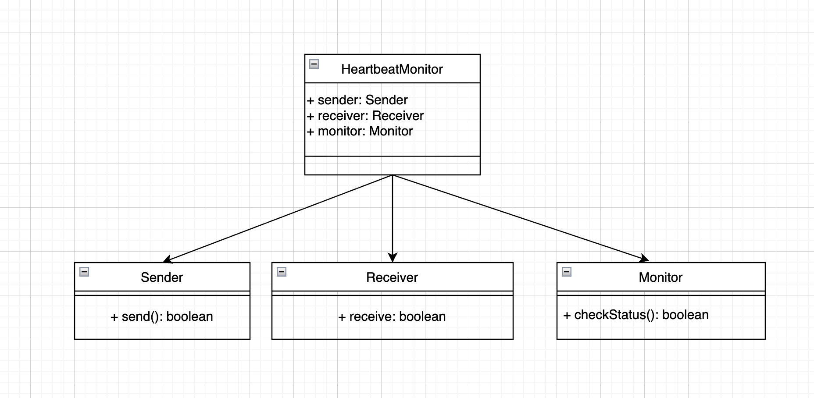

# Heartbeat
This is a simple Java prototype implementing the "Heartbeat" tactic for fault detection in an autonomous vehicle control module. The heartbeat monitors whether the control process is alive by detecting missed heartbeats and simulating non deterministic failure

## Expected behavior
2. The program will print heartbeat send/receive messages
3. The program stops if three consecutive heartbeats are missed, indicating a critical fault

## Class diagram

The class diagram models the structure of the heartbeat fault-detection system.

* HeartbeatMonitor is the orchestrator. It holds references to Sender, Receiver, and Monitor, and manages the execution loop.

* Sender is responsible for generating a heartbeat using the send() method. It may sometimes fail, simulating a fault in the control module.

* Receiver accepts the signal through the receive() method and returns whether the heartbeat was successfully delivered.

* Monitor maintains a counter of consecutive missed heartbeats and checks the overall health of the system through the checkStatus() method. If the number of missed beats exceeds the threshold, it declares a critical fault.

## Sequence diagram

The sequence diagram illustrates the runtime behavior of the heartbeat tactic across multiple iterations:

1. The System triggers the runLoop() method in HeartbeatMonitor.

2. In each cycle:

* HeartbeatMonitor calls Sender.send(), which produces a boolean signal (true = heartbeat sent, false = missed).

* The signal is passed to Receiver.receive(), which returns whether the signal was delivered.

* HeartbeatMonitor then calls Monitor.checkStatus(). The monitor updates its internal counter:

    - If the heartbeat is delivered → the counter is reset.

    - If the heartbeat is missed → the counter is incremented.

3. When the counter of missed heartbeats reaches 3 (or the configured threshold), Monitor declares a Critical Fault, and the system stops or raises an alert.

This sequence demonstrates how the heartbeat tactic detects failures by continuously monitoring a control process and reacting quickly if it becomes unresponsive.

