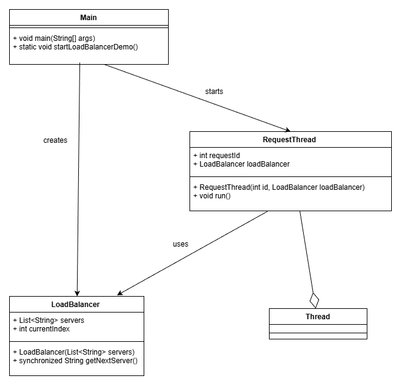
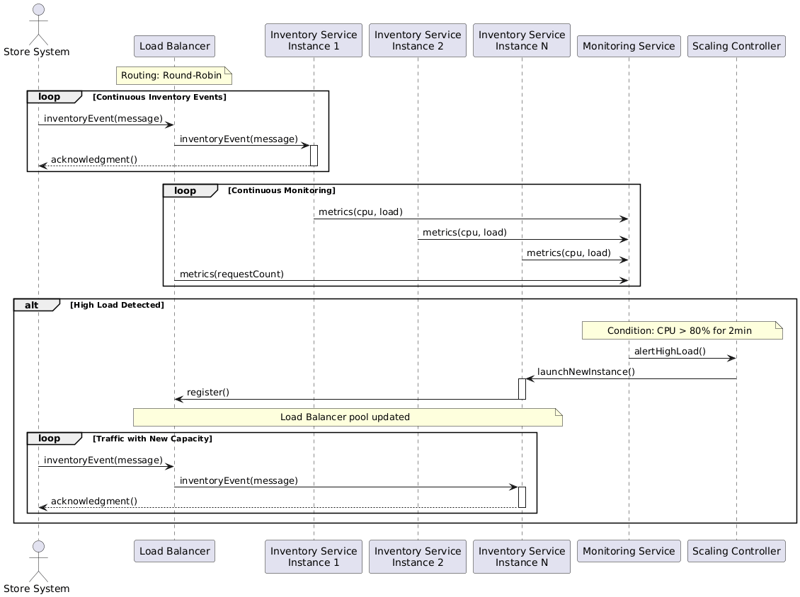
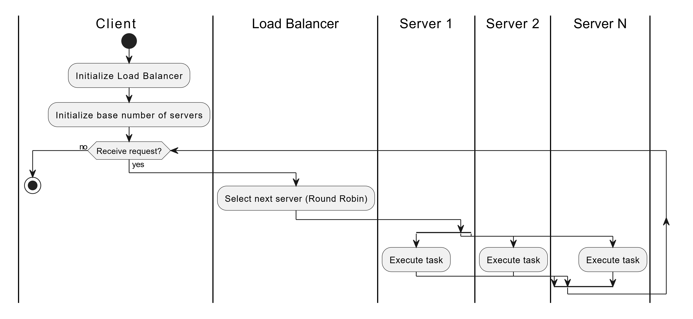

# Load Balancer Prototype

This module provides a prototype implementation of a load balancer using Java.
It simulates basic load balancing functionality by distributing incoming requests to a pool of backend servers.

## How to Run

1. Ensure you have Java installed on your machine (Java 23 or higher recommended).
2. Clone the repository to your local machine.
3. Navigate to the project directory (tacticsImplementation/loadBalancer).
4. Compile the Java files using the following command:

    ```console
    javac *.java
    ```

5. Run the load balancer simulation:

    ```console
    java Main
    ```

## Architectural approach

The primary goal of this solution is to maximize the system's performance, ensuring that thousands of inventory events and messages are handled in real time, efficiently and realiably. This is especially critical for regional supermarkets chains where accurate up to the minute stock information is essential stockouts, reduce waste and improve operational efficiency. Modern inventory management in supermarkets depends on seamless integration between real time tracking, point of sale systems and cloud platforms enabling inmediate visibility into stock levels for timely replenishment and smart decision making.

Several classic resource management tactics are implemneted in the arquitecture, with the load balancer pattern at the core. This approach directly focuses on performance by addressing the core demands of distributed inventory management such as scalability, resilience and coordinated data processing across multiple stores or distribution centers. Theses demands are critical performance drivers for handling high volumes of real time inventory data effectively.

- Increasing and distributing resources
The solution uses a set of servers to process requests which allows horizontal scaling as more servers can be dynamically added when the load increases. This is essential for operations spanning many stores or  distribution points. The load balancer distributes requests evenly avoiding overload of any single resource and improving response time. This guarantees that spikes in traffic (e.g. during sales or busy seasons) are adbsorbed without degrading performance. Distributed resources reduce the risk of bottlenecks and ensure system throughput diring variable load.

```
In the code this is represented by ```servers``` list in ```Main.java``` which can be extended dynamically as needed.
```

- Introducing concurrency
Processing requrests in parallel reduces blocked time and increases overall system throughput. This is vital for inventory platforms that face high message volumes from many stores simultaneously such as real time stock updates and order placements. Each request runs on a separate thread (```RequestThread```), leveraging multicore CPUs to boost processing capacity and reduce latency.

```
This implemented in the ```RequestThread``` class where each request runs concurrently, demonstrating the concurrency tactic.
```

- Computation replication
Replicating services enables the workload to be divided among several instances, using the load balancer pattern to distribute requests. This prevents bottlenecks and maintains high throughtput even if certain nodes fail. For regional supermarkets, replication ensures continuous performance by rerouting requests to active instances seamlessly.

```
This tactic is reflected by the load balancer distributing requests across multiple server instances listed in ```servers```.
```

- Queue size control
Maintaining stable performance requires managing the queue sizes to avoid request accumulation beyond processing capacity, which would increases latency. The load balancer serves as a arbitrator to distribute requests evenly and prevent overload.

```
Although the current code doesn't enforce strict queu limits. It can be extended with overflow management and queuing policies to sustain performance under heavy load.
```

- Resources scheduling
Effective schedualing policies reduce contention and resource conflicts, further improving performance. The implemented round robin scheduling (```getNextServer```) distributes requests evenly among servers, maximizing throughput and avoiding bottlernecks or resource exhaustion.

```
The ```getNextServer()``` method uses a simple but efficient round robin algorithm, exempliying resource scheduling. Round robin is a simple schedualing method where tasks are assigned one by one in a fixed repeating order. Each task get a turn before the cycle repeats, ensuring fair and equal distribution of resources.
```

## Design Diagrams

The load balancer prototype is designed using the following UML diagrams:

### Class Diagram



### Sequence Diagram



### Activity Diagram

