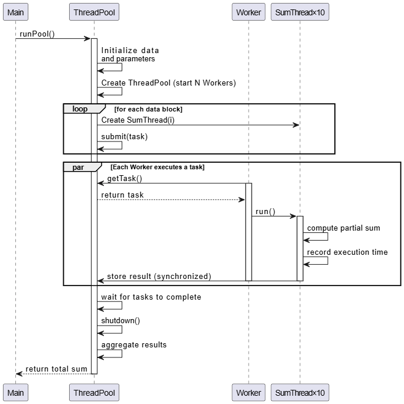

# Thread Pooling
The implemented ThreadPool create a fixed set of 10 threads (SumThread) that collectively sum different portions of a large array of integers. Each thread is assigned a segment of the array, performs a time consuming sum operation simulating work by sleeing intermittently and stores its partial result. The threads are started once and reused for their assigned work, representing a basic thread pool prototype that manages threads efficiently for a performance critical task.

## Expected behavior
1. Exactly 10 threads are created and started, each handeling a unique portion of the array
2. Each thread performs a substantial computation task including simulated delays, ensuring the task is time consuming
3. Threads operate concurrently, maximazing CPU utilization by processing different segments simultaneously
4. Threads execute their task independently, then store results in a shred structure for aggregation
5. The main program waits until all threads complete, then sums their results to output the total sum of the array

## Activity diagram

## Sequence diagram

The main starts by initializing both ThreadPool, results and data arrays. ThreadPool has a size of 10 and each data array element to 1, which data array has a total size of 100,000. Then main function starts the threads which immediately calls the run loop (designated by run message in the diagram). Now, in the loop the [less than 10] refers that the index is less than 10 as it increments by one each loop. Once in the loop, each thread that hits the condition i % 1000 = 0 will then sleep (wait), and finally that thread writes to results array. The computing total result is a for loop that calculates results array together.
